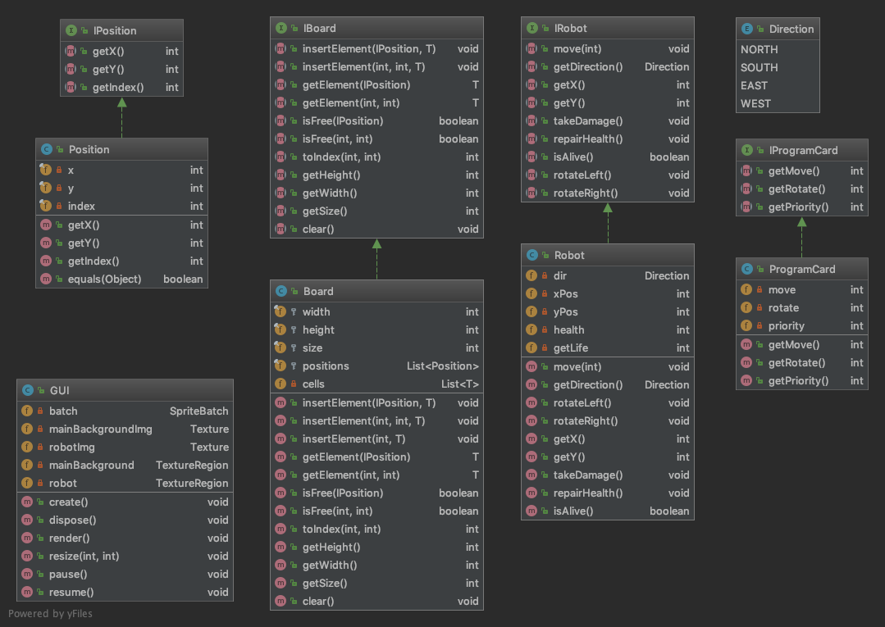

## Øvelse 2 - Robo Rally

**Del 1**

Gruppenavnet vårt er HumbleDevs. Gruppen vår består av fem personer med litt ulik akademisk bakgrunn.
Vår selvvalgte teamleader er Amalie Rovik og hun går andre året på  informasjon- og kommunikasjonsvitenskap.
Amalie er god på organisering og interessert i prosjektledelse, og dette bidro til at  hun ble vår teamleder.
Linh Nguyen er vår kundekontakt, og går tredje året på informatikk-matematikk-økonomi. Linh er en ærlig person og
er villig til å gi oss konstruktive tilbakemeldinger som kan komme godt med. Joachim Morken går tredje året på 
informasjonsvitenskap og er en dyktig programmerer. Han er optimistisk og har en positiv mentalitet. 
Dette kan bidra til en positiv stilling i gruppearbeidet. Bendik Kvernevik går tredje året datateknologi
og er flink til å programmere og designe. Han kan hjelpe oss i oppgaven hvis vi ønsker å utvikle designet
på  spillet. Even Korsgaard går andre året på datateknologi og er god på å programmere og har en god arbeidskapasitet. 

I første omgang har vi tenkt å bruke Slack som vårt kommunikasjonsverktøy. Slack er et bra sted for å koordinere og
samarbeide, når ikke alle er tilstede. Slack er tilgjengelig både på mobilen og desktop som gjør det lettere for oss å
kommunisere.  Av tekniske verktøy kommer vi til å bruke github project board.  Project board på github vil hjelpe oss
med å ha en oversikt på hva som skal gjøres.  Med project board har man fleksibiliteten til å skape tilpassede
arbeidsflyt som passer til våre behov. 

Dette semesterets programmeringsprosjekt er å lage en digital versjon av Robo Rally. Spillerne er roboter og spillet
går ut på å være førstemann i et kappløp. Gjennom spillet kan man oppgradere roboten sin, og sabotere andre roboter
sine planer ved hjelp av kort. Det overordnede målet er å lage en representasjon av Robo Rally som kan spilles lokalt.
Vi skal også skrive en ryddig og velfungerende kode.

**Del 2**

Kravene vi har til systemet finner vi på mittUib. 
Til den første innlevering skal vi implementere og tegne brettet samt plassere roboten på det.
Vi ønsker også å danne oss et helhetlig bilde av prosjektet slik at vi kan få en oversikt over
hva vi må gjøre i tiden fremover. For å skape dette bilde vil vi lage kode for de mest grunnleggende klassene
som vi måtte trenge. Dette vil for eksempel være en klasse som representerer en robot i spillet. 
I tillegg til de prosjektspesifikke gjøremålene ønsker vi også at gruppen blir bedre kjent for å kunne avdekke
hverandres ferdigheter. Dette ønsker vi å få til for at vi senere skal kunne delegere “riktige” deloppgaver til
de ulike gruppemedlemmene, og skape et godt arbeidsmiljø i gruppen.

 
**Del 3**

Vi begynner med kanban, og henter inn metodikker fra scrum eller XP, hvis vi merker at vi trenger mer struktur.
Fordelen med Kanban er at vi får visualisert arbeidet, ved å bruke project board på github. Vi får også begrense
“in progress”, og med det unngår vi at hver og en får for mye arbeid, men også alle får deltatt. Ved å bruke Kanban
får  vi et stort fokus på fremgang fra uke til uke. Det er også rom for kontinuerlig forbedring, og med dette vil vi
være mer effektive og få mer ut av arbeidet. Med å bruke Kanban vil det å se fremgangen være enkelt og vi får
lettere kontroll på hva hver gruppemedlem jobber med. Hvert gruppemedlem kan under prosessene tilføye klistremerker
i “to do”, “nice to have” og “in progress”. Når en er ferdig med sin oppgave i “in progress” markerer vi selv til
“done”. Når vi fordeler arbeidsoppgaver deler vi det slik at alle er komfortable med det de skal jobbe med.
Når vi arbeider sammen, skal det diskuteres hvordan vi skal løse problemer og skrive klasser, slik at det blir tett
samarbeid. Vi tenker forøvrig ikke å ha parprogrammering, men dette kan brukes på vanskelige/kritiske deler av spillet.
Det skal inngås testing underveis der det er nødvendig.Vi møtes to ganger  i uken, hver onsdag kl 16.30 og
på gruppetimen.
Det skrives møtereferat etter møtene.

**Oppsummering**

Vi er enige om at vi har hatt en moderat start på dette gruppeprosjektet. Det har gått mye tid på å sette seg inn 
programvare når vi har møttes, istedenfor produktivt arbeid med prosjektoppgaven. For eksempel hadde flertallet i 
gruppen for dårlig kompetanse i git og github, noe som har ført til at det har oppstått diverse problemer og mye tid 
har gått til lite. Heldigvis har dette gått helt fint og nå er alle i gruppen oppe på et tilfredsstillende 
ferdighetsnivå i git og github.

Vi har også kommet fram til at vi må bli flinkere til å bruke de verktøyene som har bestemt oss for å bruke. 
Project board i github har blitt brukt, men ofte blir det helt glemt. 
For at vi fremover skal lykkes med prosjektet må vi blir flinkere på å bruke project board, og ha en mer åpen 
kommunikasjon på slack.

Vi har også hatt litt problemer med å forstå LibGdx, og finne ut av hvordan det er best å representere et 2D-grid med 
dette biblioteket, men dette begynner å løsne nå.
Ellers så er vi fornøyde med hvordan vi har lagt opp dette prosjektarbeidet. Møtene er vellykket og når noen har 
problemer gjør vi en kollektiv innsats for å hjelpe til. Vi er positive til resten av prosjekttiden.

**Innhold i presentasjonen 19.02**

* Presentasjon av gruppen
* Hovedresultater
    * Tegning av brett
    * Hovedklasser
    * UML – diagram
* Utfordringer
    * Libgdx
    * Git og github
* Løsninger
	* Opplæring i git og github
	* Ansvar for Libgdx
* Forbedringer
	* Bruke verktøy mer aktivt
	* Mer åpen kommunikasjon
	* Bedre forberedelser
* Konklusjon
	* Dette fikser vi

**Class Diagram**

